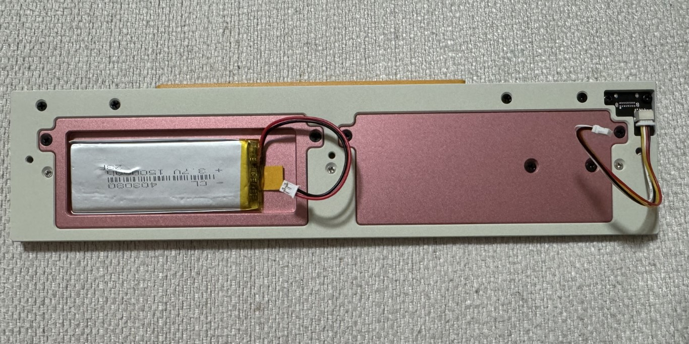

# falcon_parts

By using the parts from this project to replace the original parts of the keyboard, the 403080 battery (about 1300mAh) can be installed in the keyboard.

## tips

You can only use right parts to replace, However there is a possibility that the colors on the left and right may not match.

## pictures

